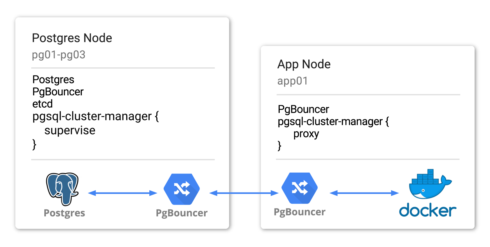

# pgsql-cluster-manager [](https://circleci.com/gh/gocardless/pgsql-cluster-manager)

`pgsql-cluster-manager` extends a standard highly-available Postgres setup
(managed by [Corosync](http://corosync.github.io/) and
[Pacemaker](http://www.linux-ha.org/wiki/Pacemaker)) enabling its use in cloud
environments where using using floating IPs to denote the primary node is
difficult or impossible. In addition, `pgsql-cluster-manager` provides the
ability to run zero-downtime failover of the Postgres primary with a simple API
trigger.

See [Playground](#playground) for how to start a Dockerised three node Postgres
cluster with `pgsql-cluster-manager`.

- [Overview](#overview)
    - [Playground](#playground)
    - [Node Roles](#node-roles)
        - [Postgres Nodes](#postgres-nodes)
        - [App Nodes](#app-nodes)
    - [Zero-Downtime Failover](#zero-downtime-failover)
- [Configuration](#configuration)
    - [Pacemaker](#pacemaker)
    - [PgBouncer](#pgbouncer)
- [Development](#development)
    - [CircleCI](#circleci)
    - [Releasing](#releasing)

## Overview

GoCardless runs a highly available Postgres cluster using
[Corosync](http://corosync.github.io/) and
[Pacemaker](http://www.linux-ha.org/wiki/Pacemaker). Corosync provides an
underlying quorum mechanism while pacemaker provides the ability to register
plugins that can manage arbitrary services, detecting and recovering from node
and service-level failures.

The typical Postgres setup with Corosync & Pacemaker uses a floating IP attached
to the Postgres primary node. Clients connect to this IP, and during failover
the IP is moved to the new primary. Managing portable IPs in Cloud providers
such as AWS and GCP is more difficult than a classic data center, and so we
built `pgsql-cluster-manager` to adapt our cluster for these environments.

`pgsql-cluster-manager` makes use of [etcd](https://github.com/coreos/etcd) to
store cluster configuration, which can then be used by clients to connect to the
appropriate node. We can view `pgsql-cluster-manager` as two distinct services:

- `proxy` ensures our Postgres proxy (PgBouncer) is reloaded with the current
  primary IP, using etcd as the authoritative source
- `supervise` runs on our Postgres nodes, extracting data from pacemaker and
  pushing it into etcd. In addition, `supervise` provides a gRPC API that can be
  used to trigger manual failover

The final component is the `failover` command, which speaks to the `supervise`
processes to trigger a manual failover.

### Playground

We have created a Dockerised sandbox environment that boots a three node
Postgres cluster with the `pgsql-cluster-manager` services installed. We
strongly recommend playing around in this environment to develop an
understanding of how this setup works and to simulate failure situations
(network partitions, node crashes, etc).

**It also helps to have this playground running while reading through the README,
in order to try out the commands you see along the way.**

First install [Docker](https://docker.io/) and Golang >=1.9, then run:

```
# Clone into your GOPATH
$ git clone https://github.com/gocardless/pgsql-cluster-manager
$ cd pgsql-cluster-manager
$ make bin/pgcm.linux_amd64

$ cd docker/postgres-member && ./start
Sending build context to Docker daemon 4.332 MB
Step 1/16 : FROM gocardless/pgsql-cluster-manager
...

root@pg01:/# crm_mon -Afr -1

Node Attributes:
* Node pg01:
    + Postgresql-data-status            : STREAMING|SYNC
    + Postgresql-status                 : HS:sync
    + master-Postgresql                 : 100
* Node pg02:
    + Postgresql-data-status            : STREAMING|POTENTIAL
    + Postgresql-status                 : HS:potential
    + master-Postgresql                 : -INFINITY
* Node pg03:
    + Postgresql-data-status            : LATEST
    + Postgresql-master-baseline        : 0000000002000090
    + Postgresql-status                 : PRI
    + master-Postgresql                 : 1000

root@pg01:/# ping pg03 -c1 | head -n1
PING pg03 (172.17.0.4) 56(84) bytes of data.

root@pg01:/# ETCDCTL_API=3 etcdctl get --prefix /
/postgres/master
172.17.0.4
```

The [start](docker/postgres-member/start) script will boot three Postgres nodes
with the appropriate configuration, and will start a full Postgres cluster. The
script (for convenience) will enter you into a docker shell in `pg01`.
Connecting to any of the other containers can be achieved with `docker exec -it
pg0X /bin/bash`.

### Node Roles

The `pgsql-cluster-manager` services are expected to run on two types of
machine: the nodes that are members of the Postgres cluster, and the machines
that will host applications which will connect to the cluster.



To explain how this setup works, we'll use an example of three machines (`pg01`,
`pg02`, `pg03`) to run the Postgres cluster and one machine (`app01`) to run our
client application. To match a typical production environment, let's imagine we
want to run a docker container on `app01` and have that container connect to our
Postgres cluster, while being resilient to Postgres failover.

It's worth noting that our playground configures only nodes of the Postgres
type, as this is sufficient to test out and play with the cluster. In production
you'd run app nodes so that applications can connect to the local PgBouncer,
which in turn knows how to route to the primary.

For playing around, it's totally fine to connect to one of the cluster nodes
PgBouncers directly from your host machine.

#### Postgres Nodes

In this hypothetical world we've provisioned our Postgres boxes with corosync,
pacemaker and Postgres, and additionally the following services:

- [PgBouncer](https://pgbouncer.github.io/) for connection pooling and proxying
  to the current primary
- [etcd](https://github.com/coreos/etcd) as a queryable store of cluster state,
  connecting to provide a three node etcd cluster

We then run the `supervise` service as a daemon, which will continually query
pacemaker to pull the current Postgres primary IP address and push this value to
etcd. Once we're pushing this value to etcd, we can use the `proxy` service to
subscribe to changes and update the local PgBouncer with the new value. We do
this by provisioning a PgBouncer [configuration template file](
docker/postgres-member/pgbouncer/pgbouncer.ini.template) that looks like the
following:

```
# /etc/pgbouncer/pgbouncer.ini.template

[databases]
postgres = host={{.Host}} pool_size=10
```

Whenever the `supervise` service pushes a new IP address to etcd, the `proxy`
service will render this template and replace any `{{.Host}}` placeholder with
the latest Postgres primary IP address, finally reloading PgBouncer to direct
connections at the new primary.

We can verify that `supervise` is pushing the IP address by using `etcdctl` to
inspect the contents of our etcd cluster. We should find the current Postgres
primary IP address has been pushed to the key we have configured for
`pgsql-cluster-manager`

```
root@pg01:/$ ETCDCTL_API=3 etcdctl get --prefix /
/postgres/master
172.17.0.2
```

#### App Nodes

We now have the Postgres nodes running PgBouncer proxies that live-update their
configuration to point connections to the latest Postgres primary. Our aim is
now to have app clients inside docker containers to connect to our Postgres
cluster without having to introduce routing decisions into the client code.

To do this, we install PgBouncer onto `app01` and bind to the host's private
interface. We then allow traffic from the docker network interface to the
private interface on the host, so that containers can communicate with the
PgBouncer on the host.

Finally we configure `app01`'s PgBouncer with a configuration template as we did
with the Postgres machines, and run the `proxy` service to continually update
PgBouncer to point at the latest primary. Containers then connect via the docker
host IP to PgBouncer, which will transparently direct connections to the correct
Postgres node.

```sh
root@app01:/$ cat <EOF >/etc/pgbouncer/pgbouncer.ini.template
[databases]
postgres = host={{.Host}}
EOF

root@app01:/$ service pgcm-proxy start
pgcm-proxy start/running, process 6997

root@app01:/$ service pgbouncer start
 * Starting PgBouncer pgbouncer
   ...done.

root@app01:/$ tail /var/log/pgsql-cluster-manager/proxy.log | grep HostChanger
{"caller":"fold.go:27","event":"operation.run","key":"/master","revision":2,"ts":"2018-12-20T12:46:28.216393488Z","value":"172.17.0.2"}
{"caller":"proxy.go:71","event":"pgbouncer.reload_configuration","host":"172.17.0.2","ts":"2018-12-20T12:46:28.21651219Z"}

root@app01:/$ tail /var/log/postgresql/pgbouncer.log | grep "RELOAD"
2018-12-20 12:46:28.218 3232 LOG RELOAD command issued

# Attempt to connect via the docker bridge IP
root@app01:/$ docker run -it --rm jbergknoff/postgresql-client postgresql://postgres@172.17.0.1:6432/postgres
Password:
psql (9.6.5, server 9.4.14)
Type "help" for help.

postgres=#
```

### Zero-Downtime Failover

It's inevitable over the lifetime of a database cluster that machines will need
upgrading, and services restarting. It's not acceptable for such routine tasks
to require downtime, so `pgsql-cluster-manager` provides an API to trigger
failover of the Postgres primary without disrupting database clients.

This API is served by the `supervise` service, which should be run on all the
Postgres nodes participating in the cluster. It's important to note that this
flow is only supported when all database clients are using PgBouncer transaction
pools in order to support pausing connections. Any clients that use session
pools will need to be turned off for the duration of the failover.

1. Acquire lock in etcd (ensuring only one failover takes place at a time)
2. Pause all PgBouncer pools on Postgres nodes
3. Instruct Pacemaker to perform failover of primary to sync node
4. Once the sync node is serving traffic as a primary, resume PgBouncer pools
5. Release etcd lock

This flow is encoded in the `Run` method in the [Run](pkg/failover/failover.go)
method, and looks like this:

```go
Pipeline(
  Step(f.HealthCheckClients),
  Step(f.AcquireLock).Defer(f.ReleaseLock),
  Step(f.Pause).Defer(f.Resume),
  Step(f.Migrate).Defer(f.Unmigrate),
)
```

As the primary moves machine, the `supervise` service will push the new IP
address to etcd. The `proxy` services running in the Postgres and App nodes will
detect this change and update PgBouncer to point at the new primary IP, while
the failover flow will detect this change in step (4) and resume PgBouncer to
allow queries to start once more.

```
root@pg01:/$ pgcm --config-file /etc/pgsql-cluster-manager/config.toml failover
config_file=/etc/pgsql-cluster-manager/config.toml event=config_file.loading
config_file=/etc/pgsql-cluster-manager/config.toml event=config_file.loaded hash=1.5370943342052e+14
event=client.connecting endpoint=pg01:8080
event=client.connecting endpoint=pg02:8080
event=client.connecting endpoint=pg03:8080
event=clients.health_check msg="health checking all clients"
event=etcd.lock.acquire msg="acquiring failover lock in etcd"
event=clients.pgbouncer.pause msg="requesting all pgbouncers pause"
event=clients.pgbouncer.pause endpoint=pg02:8080 elapsed=0.0066053
event=clients.pgbouncer.pause endpoint=pg03:8080 elapsed=0.0070081
event=clients.pgbouncer.pause endpoint=pg01:8080 elapsed=0.0087637
event=clients.pacemaker.migrate endpoint=pg02:8080 msg="requesting pacemaker migration"
event=clients.pacemaker.migrate endpoint=pg02:8080 key=/master target=172.17.0.4 msg="waiting for etcd to update with master key"
keys=/master event=watch.start
keys=/master event=poll.start
keys=/master event=poll.start
key=/master value=172.17.0.2 revision=2 event=stale_revision previous=2
keys=/master event=poll.start
key=/master value=172.17.0.2 revision=2 event=stale_revision previous=2
keys=/master event=poll.start
key=/master value=172.17.0.2 revision=2 event=stale_revision previous=2
keys=/master event=poll.start
key=/master value=172.17.0.2 revision=2 event=stale_revision previous=2
keys=/master event=poll.start
key=/master value=172.17.0.2 revision=2 event=stale_revision previous=2
keys=/master event=poll.start
key=/master value=172.17.0.2 revision=2 event=stale_revision previous=2
event=clients.pacemaker.migrate endpoint=pg02:8080 msg="observed successful migration" master=pg03
event=clients.pacemaker.unmigrate endpoint=pg01:8080 msg="requesting pacemaker unmigrate"
event=clients.pgbouncer.resume msg="requesting all pgbouncers resume"
event=clients.pgbouncer.resume endpoint=pg03:8080 elapsed=0.0064509
event=clients.pgbouncer.resume endpoint=pg02:8080 elapsed=0.007664
event=clients.pgbouncer.resume endpoint=pg01:8080 elapsed=0.0082347
event=etcd.lock.release msg="releasing failover lock in etcd"
```

This flow is subject to several timeouts that should be tuned to match your
pacemaker cluster settings. See `pgcm failover --help` for an explanation of
each timeout and how it affects the failover. This flow can be run from
anywhere that has access to the etcd and Postgres failover API.

The Postgres node that was originally the primary is now turned off, and won't
rejoin the cluster until the lockfile is removed. You can bring the node back
into the cluster by doing the following:

```
root@pg02:/$ rm /var/lib/postgresql/9.4/tmp/PGSQL.lock
root@pg02:/$ crm resource cleanup msPostgresql
```

## Configuration

We recommand configuring `pgsql-cluster-manager` using a TOML configuration
file. You can generate a sample configuration file with the default values for
each paramter by running the following:

```
$ pgcm show-config >/etc/pgsql-cluster-manager/config.toml
```

### Pacemaker

The test environment is a good basis for configuring pacemaker with the pgsql
resource agent, and gives an example of cluster configuration that will
bootstrap a Postgres cluster.

We load pacemaker configuration in tests from the `configure_pacemaker` function
in [start-cluster.bash](docker/postgres-member/start-cluster.bash), though we
advise thinking carefully about what appropriate timeouts might be for your
setup.

The [pgsql](docker/postgres-member/resource_agents/pgsql) resource agent has
been modified to remove the concept of a primary floating IP. Anyone looking to
use this cluster without a floating IP will need to use the modified agent from
this repo, which renders the primary's actual IP directly into Postgres'
`recovery.conf` and reboots database replicas when the primary changes
(required, given Postgres cannot live reload `recovery.conf` changes).

## Development

### CircleCI

We build a custom Docker image for CircleCI builds that is hosted at
gocardless/pgsql-cluster-manager-circleci on Docker Hub. The Dockerfile lives at
`.circleci/Dockerfile`, and there is a make target to build and push the image.

To publish a new version of the Docker image, run:

```bash
make publish-circleci-dockerfile
```

### Releasing

We use [goreleaser](https://github.com/goreleaser/goreleaser) to create releases
for `pgsql-cluster-manager`. This enables us to effortlessly create new releases
with all associated artifacts to various destinations, such as GitHub and
homebrew taps.

To generate a new release, you must first tag the desired release commit and
then run `goreleaser` with a GitHub token for an account with write access to
this repo.

```sh
git tag v0.0.5 HEAD
GITHUB_TOKEN="..." goreleaser
```
